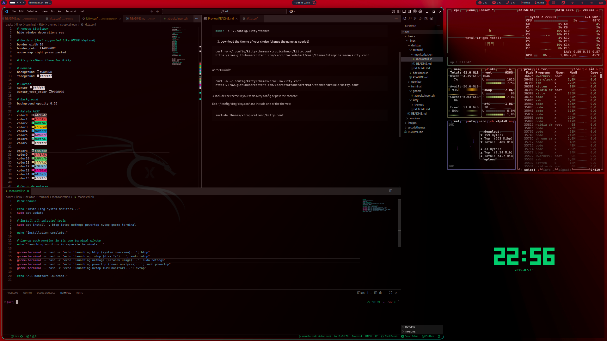
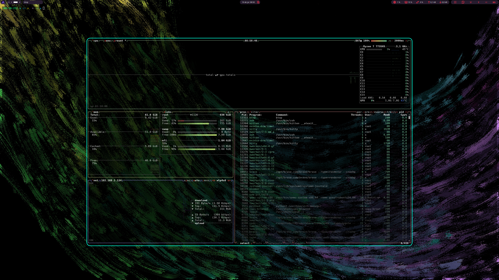

# A repository to fully customize your operating system

## Structure:

```tsx
Art
|
|->images // graphical resources, Images, wallpapers, related scripts
|    |_Color
|    |_B&N
|
|->basics //choose your system
|   |
|   |->linux //concentration of stylizations for Linux
|   |   |_ Environment: Look&Feel, terminals, tools, desktop, extensions etc.
|   |
|   |->windows //concentration of stylizations for Windows
|        |_ Environment: Look&Feel, terminal, tools, post installation,
|
|->general // Changes to applications or interfaces present in any system
|   |
|   |->vscodethemes
|   |
|   |
//growing

```

## Linux Preview:


<p align="center">
  
  
</p>
