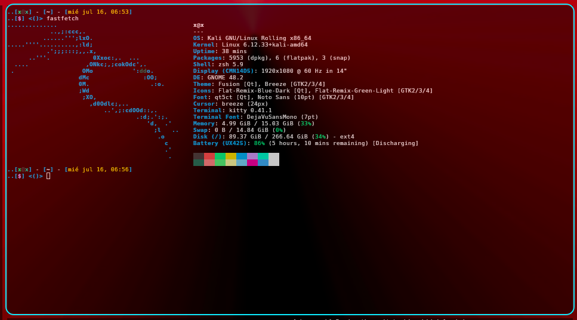

# xtropicalneon theme for kitty


### [xtropicalneon](./kitty.conf)


<p align="center">
  
</p>

## Installation procedures:

1. download the kitty.conf
    * Copy the file to your path: ~/.config/kitty/

2. download the kitty.conf
    * Create the directory if not exists:
    ``` bash
        mkdir -p ~/.config/kitty/themes/xtropicalneon
    ```
    * set the theme in your .conf file
```bash
echo "include themes/xtropicalneon/kitty.conf" >> ~/.config/kitty/kitty.conf
```