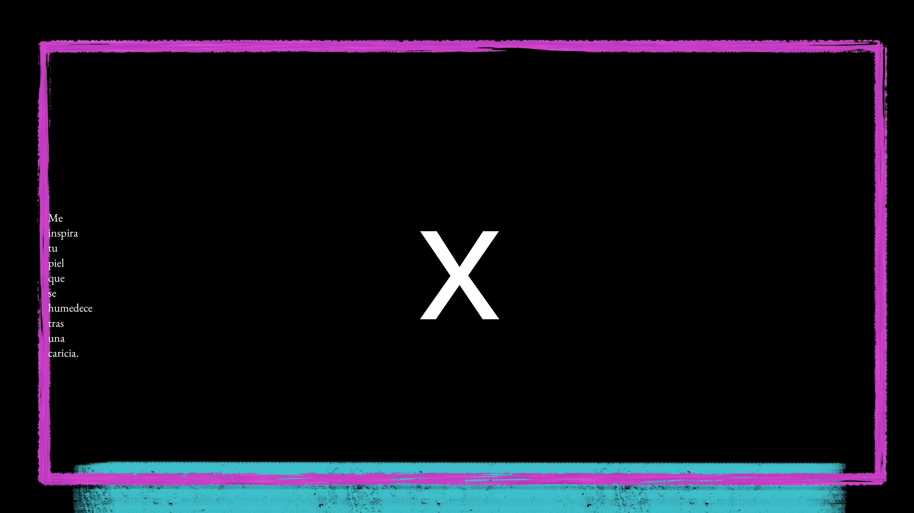
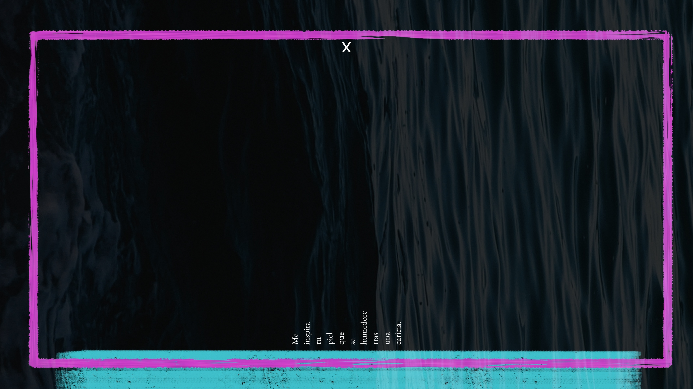

# Images/Color/preview

## There`s different categories in color:
* Pure painting/ilustration art for general purpose.
* Distros art:
    * [kali](./kali/)

### Download options:

1. You can manually explore and download files from gh one by one.
2. Download the zip.
3. Using git filter:
```bash
git clone --filter=blob:none --sparse https://github.com/xscriptorcode/art.git
cd art
git sparse-checkout set images/color
```

## Preview

<p align="center">
  
  
  
  
</p>


