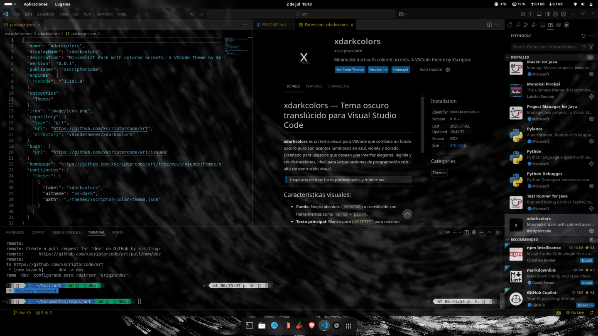

# xdarkcolors — Tema oscuro para Visual Studio Code

**xdarkcolors** es un tema visual para VSCode que combina un fondo oscuro puro con acentos luminosos en azul, violeta y dorado. Diseñado para usuarios que desean una interfaz elegante, legible y sin distracciones, ideal para largas sesiones de programación con alta concentración visual.

> Inspirado en interfaces profesionales y modernas. 

---

## Características visuales:

- **Fondo**: Negro absoluto (`#000000`) o translúcido con herramientas como `xprop` + `picom`.
- **Texto principal**: Blanco puro (`#ffffff`) para máxima legibilidad.
- **Funciones y métodos**: Azul claro (`#41b3ff`) y violeta frío.
- **Palabras clave**: Amarillo dorado (`#FFD700`, `#FFCC33`) para resaltar lógica importante.
- **Cadenas y constantes**: Azul cielo (`#79d9ff`).
- **Comentarios**: Azul apagado (`#145479`), en *italic*, no invasivo.
- **Sidebars y menú**: Integrados en fondo oscuro, sin distracción cromática.

---

## Vista previa



---

## Instalación:

### 1. Ejecuta desde la terminal:

```bash
code --install-extension xdarkcolors-0.0.1.vsix
```

### 2. abre vscode en el directorio, presiona click derecho sobre la extensión dentro de vscode y presiona en instalar extensión mediante vsix